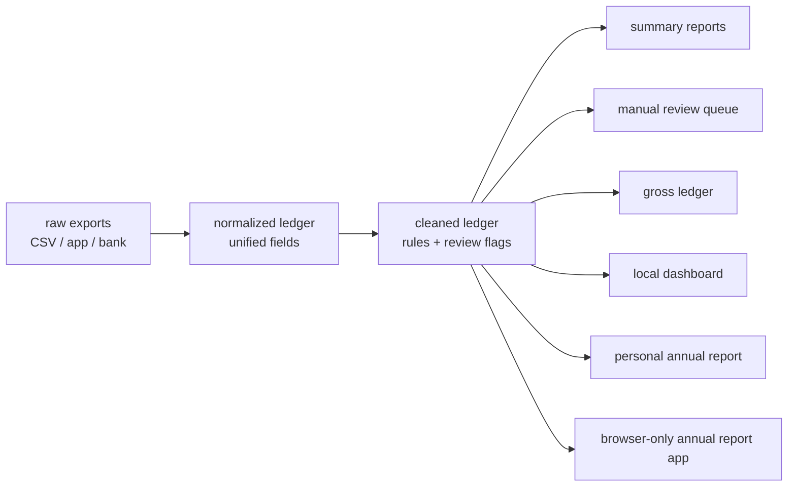

# Personal Ledger Pipeline

[](https://github.com/sugarfolds/personal-ledger-pipeline/actions/workflows/demo.yml)
[](LICENSE)

A local-first, source-first data pipeline that turns messy personal finance exports into a traceable ledger, then generates a mildly judgmental personal annual report from the cleaned rows.

This is a **portfolio-safe demo**. It contains only synthetic transactions and does not include real bank statements, account balances, merchants, transaction IDs, or counterparties.

## Highlights

- Normalizes multi-source exports from payment apps, bank cards, and platform bills.
- Separates real consumption from monthly repayments, internal transfers, matched refunds, and duplicate bank charges.
- Preserves source evidence through `source_file` and `raw_row_number`.
- Sends ambiguous rows to a manual-review queue instead of silently guessing.
- Generates reproducible cleaned ledgers, summaries, review queues, a local HTML dashboard, and a bilingual web annual report.
- Adds a private-data local run path through `scripts/import_raw.py` and `scripts/run_pipeline.py`.
- Includes a browser-only annual report prototype under `web/annual-report/` for local CSV / JSON uploads.

## Example Annual Report

Open the generated web demo: [examples/annual_report_2026.html](examples/annual_report_2026.html).

The report keeps the financial math traceable, then adds annual-report-style commentary: shareholder letter, MD&A, risk factors, segment performance, capital allocation review, auditor notes, and a consumption persona. The generated dashboard and annual report can switch between English and Chinese; the annual report also includes an in-page chart explorer. The two language versions keep similar meaning while using language-specific phrasing. The tone is intentionally sharper than a budgeting app: serious about classification, less patient with financial self-flattery.

## Demo In One Command

```bash
make demo
```

Most generated outputs are ignored by git and can be recreated locally at any time. The `examples/` annual report files are tracked as portfolio-safe previews.

```text
processed/normalized/current_ledger_2026-04-01_to_2026-04-30.csv
processed/cleaned/current_ledger_2026-04-01_to_2026-04-30.cleaned.csv
final/summary/summary_2026-04-01_to_2026-04-30.md
final/review/manual_review_queue_2026-04-01_to_2026-04-30.csv
final/ledger/gross_ledger_2026-04-01_to_2026-04-30.csv
final/visual/dashboard_2026-04-01_to_2026-04-30.html
final/annual_report/annual_report_2026.html
final/annual_report/annual_report_2026.md
examples/annual_report_2026.html
examples/annual_report_2026.md
```

## Test The Pipeline

```bash
make test
```

The test suite uses the synthetic source fixtures to check parser coverage, repayment exclusion, internal-transfer exclusion, refund deductions, duplicate bank shadows, and manual-review decisions.

## Use Your Own Data Locally

The public demo stays synthetic. For private exports, run everything locally and keep generated files out of Git history.

```bash
python3 scripts/import_raw.py raw --out parsed
python3 scripts/run_pipeline.py raw
```

This writes private local outputs:

```text
processed/normalized/current_ledger_<period>.csv
processed/cleaned/current_ledger_<period>.cleaned.csv
final/summary/summary_<period>.md
final/review/manual_review_queue_<period>.csv
final/review/review_decisions_<period>.template.csv
final/ledger/gross_ledger_<period>.csv
```

Review `final/review/` before treating the summary as final. To apply manual decisions, fill the template file and rerun:

```bash
python3 scripts/run_pipeline.py raw --review-decisions final/review/review_decisions_<period>.template.csv
```

The importer scans source-specific folders such as `raw/alipay/`, `raw/wechat/`, `raw/meituan/`, `raw/douyin/`, and `raw/bank/<boc|cmb|icbc|abc>/`. CSV is the stable v1 path; XLSX intake is available through `openpyxl`; PDF formats are called out with actionable warnings because those exports vary heavily by platform and bank.

More detail:

- [Use your own data locally](docs/use_with_your_own_data.md)
- [Supported sources](docs/supported_sources.md)
- [Privacy and local run checklist](docs/privacy_local_run.md)

## Browser-Only Annual Report App

Open the static app locally:

```text
web/annual-report/index.html
```

Upload a cleaned ledger CSV or normalized JSON. The app parses, cleans, aggregates, renders, and exports inside the browser tab. It has no backend API, login, or upload step.

Current browser v1 supports:

- CSV / JSON import,
- EN / Chinese switching,
- serious, board-roast, and social-share styles,
- Markdown, HTML, and PNG export,
- repayment, internal-transfer, refund, duplicate-bank-shadow, and review-queue logic.

## Why This Exists

Consumer finance exports are not clean analytics data. A single real-world payment can appear across multiple systems:

- an app-side purchase,
- a bank-side card charge,
- a later monthly repayment,
- a partial or full refund,
- an internal wallet transfer,
- or an item that needs manual review.

This project demonstrates how to turn messy exports into a traceable ledger pipeline without handing credentials to a third party. It also shows how the cleaned ledger can support an annual-report layer: serious financial tables plus a lightly playful narrative about consumption habits.

## Pipeline Architecture



Key design principles:

- **Local-first**: works from exported files, no bank login or cloud sync.
- **Source-first**: raw files are preserved; every derived row keeps source and row number.
- **Rule-based but reviewable**: deterministic rules handle stable cases; ambiguous rows go to a review queue.
- **No direct edits to final outputs**: fix rules or review decisions, then rerun.

## What The Sample Covers

The synthetic sample data includes:

- app payments paid by wallet or monthly credit,
- monthly repayments that should not be counted as new consumption,
- full and partial refunds,
- a bank charge shadowed by an app-side payment,
- an internal transfer between bank and wallet,
- an ambiguous record sent to manual review.

## Reconciliation Examples

| Case | Handling |
| --- | --- |
| Monthly repayment | Excluded from new consumption while original purchases remain traceable |
| Matched refund | Deducted from net consumption instead of treated as ordinary income |
| Duplicate bank charge | Marked as app-side shadow when amount and time match |
| Internal transfer | Excluded from spend/income views via `transfer_scope=internal` |
| Ambiguous wallet flow | Sent to `manual_review_queue` with original source location |

## Annual Report Generator

The v1 annual report is generated from the cleaned ledger only. It does not read raw exports directly, does not call an LLM, and does not invent account balances.

It produces a static web report and a Markdown text version with:

- a shareholder letter,
- financial highlights,
- a simplified personal income statement,
- a simplified personal cash flow statement,
- a balance-sheet limitation note for the ledger-only demo,
- Management Discussion and Analysis,
- Risk Factors,
- Segment Performance,
- Capital Allocation Review,
- Auditor Notes,
- a lightweight consumption persona,
- and a board verdict.

The web report includes an in-page EN / Chinese toggle and a small chart explorer for source segments, cash-flow classes, and governance items. The Chinese copy is localized for tone rather than translated word-for-word.

The balance sheet is intentionally limited in v1 because transaction exports alone do not prove assets, liabilities, or ending balances. A future version can add balance snapshots as a separate private input.

## Core Fields

| Field | Purpose |
| --- | --- |
| `source` / `source_file` / `raw_row_number` | Evidence trail back to the original export |
| `direction` | Normalized cash direction: `expense`, `income`, or `neutral` |
| `normalized_type` | Business type such as `merchant_payment`, `refund_in`, `credit_repayment`, `internal_transfer` |
| `transfer_scope` | Separates external spending from internal account flow or debt repayment |
| `include_in_ledger` | Whether the row contributes to the main ledger view |
| `clean_status` / `clean_rule` | Explainable cleaning decision |
| `needs_review` | Flags rows that require human confirmation |

## Privacy Model

This public repository is designed around a hard boundary:

- Real exports belong in a private working directory.
- Public demo data must be synthetic.
- IDs, names, merchants, account hints, and balances must be fake.
- `.gitignore` blocks generated outputs and private raw data by default.
- CI runs `make test` and `make demo` so parser and cleaning regressions are caught before publishing.

See [SECURITY.md](SECURITY.md) for the publishing checklist.

## Portfolio Framing

This is not a full personal finance app. It is a data pipeline demo focused on:

- schema design,
- reconciliation logic,
- refund and repayment handling,
- manual-review workflow,
- annual-report generation from cleaned ledger data,
- reproducible outputs,
- and privacy-safe project packaging.

## Repository Layout

```text
raw/                    synthetic sample exports only
examples/               tracked demo annual report outputs
scripts/                runnable sample pipeline
scripts/parsers/        source-specific raw import registry
scripts/core/           shared ledger schema and cleaning rules
web/annual-report/      static browser-only annual report prototype
templates/              deterministic narrative template examples
skills/                 repo-distributed Codex skill workflow
schema/rules/           unified ledger field definitions
docs/                   portfolio notes and public-boundary guidance
processed/              generated normalized and cleaned outputs, gitignored
final/                  generated reports and dashboard, gitignored
```
